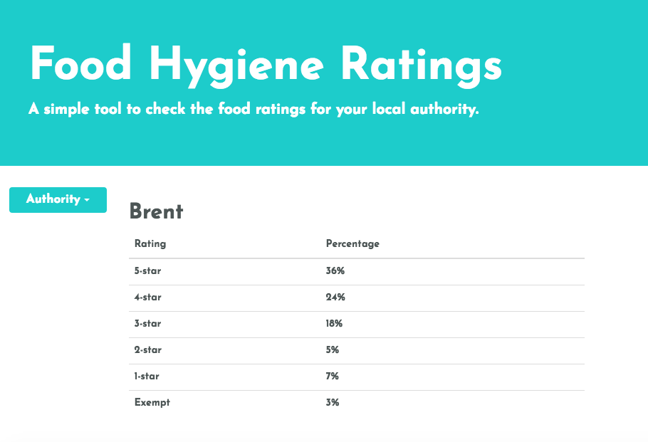
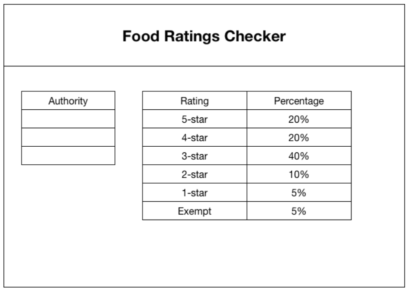
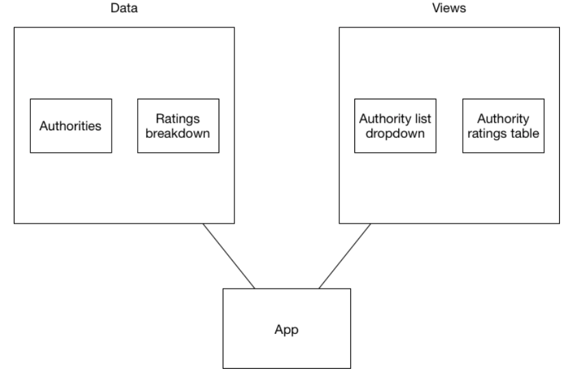

# Food Ratings App



# Introduction
This is the Food Ratings App, where I have created a simple web application using the API and data sources at http://api.ratings.food.gov.uk/help that fulfils the user story below:

```
As a user

I want to see how food hygiene ratings are distributed by percentage across a selected Local Authority

so that I can understand the profile of establishments in that authority. 
```

I wrote the application in React with Redux. I had previously had a little experience using React Native, but no experience with Redux, so I spent my time learning a lot about both during this task. I used create-react-app.

## Instructions to run

1. Clone the repo using `git clone git@gitlab.com:freddyfallon/food-hygiene-ratings.git`
2. Make sure you have node installed
3. `cd`into the directory, and run `npm install`
4. Then run `npm start` and you can visit the app at http://localhost:3000/
5. You can also run the tests using `npm test`, but my test coverage is way below what I would like, more on that in the challenges section!

## Planning the application

The first thing I did was explore the API endpoints using Postman. This allowed me to understand how I should be accessing the endpoints, and what headers I needed to use. It also allowed me to see the output and then plan how I would work with the data. 

I then spent some time thinking about the technologies that I would use. I decided on React and Redux because I felt that state would play a large role in this task. I had some limited experience working in React Native but never used Redux, and I was keen to learn how they both worked together.

I then planned out a quick wireframe of what I thought the application should look like:



This helped me think about the different components involved (search and ratings), and to think about where I would need to hold data. This is illustrated in the diagram below:



I decided that there should two stores of data, one from each API call made: authorities and ratings, and that these should feed into the authority list and ratings table respectively. Knowing this gave me an understanding of what I was building and allowed me to start understanding the steps I needed to take to achieve this.

## Building the application

My first step in building the application was simply to spin up a React boilerplate app using create-react-app and Bootstrap. I decided to use create-react-app because I didn’t want to worry too much about configuration so that I could focus on the actual functionality.

I then started building my components, which was simple enough. I then did a lot of research into Redux, and began to build out the reducer and action for getting authorities. This also meant that I had to change my components into containers. I initially used request and request-promise to achieve this, but then decided to use axios as I found it easier to get it working in the actual app. 

This took ages, and I eventually got the list of authorities to appear in the dropdown on Saturday night. The authorities are loaded up in the componentDidMount of the search component.

I then started to think about how I would actually get the ratings from the Authorities API call. I spent a good amount of time playing with axios in my node console, and I eventually got it working.

I used a lot of online references, including a Udemy React course and also Stack Overflow to better understand how to use React with Redux.

## Successes

My big success was clearly getting it working as a whole. I really enjoyed using React and found the experience really valuable because I got to learn how to use a front-end framework in a new way. I made regular commits, which proved useful as I had to roll back to previous code quite often.

I was also pleased with how I approached this task, and feel that it really helped me understand what steps I needed to take and to actually complete it.

## Challenges

All along the way, testing was incredibly challenging when building this application. I played with a few different frameworks but had a lot of difficulty understanding them and implementing anything of any value. I ended up using Jest, but frankly, the tests are quite unsatisfactory. I was unable to TDD this app, because I was simply so unfamiliar with how to test a React app. I think I would take into account how difficult I found testing when considering React in the future.

More generally, I found Redux extremely unintuitive, and it took me a very long time to understand reducers, actions, containers, and the relation between all three. I still struggle with these concepts.

## How I would improve it in future

The most glaring thing that I would like to improve is testing. I want to learn more about testing in React, and testing API calls effectively. More generally, I would like to add some loading visuals that kick in when the authority is clicked, because sometimes this can take around ten seconds. I would also like to more generally improve the speed of loading here too.

I would also like to add error handling. If the API goes down (which it did a few times while I was building this), then the user doesn’t get a message telling them about this issue.